<p align="center">
  
</p>

<h1 align="center">Trời Ơi</h1>

<p align="center">
  A weather app for Android and iOS. One shared codebase, two native apps, built with
  Kotlin Multiplatform and Compose Multiplatform.
</p>

<p align="center">
  
  
  
  
  <a href="LICENSE"></a>
</p>

Search for a city, save up to six places, and check the current conditions, a 7-day outlook, and
how much rain to expect hour by hour. It caches what it fetches so it still works offline, tints
itself to match the weather, and lets you switch between metric and imperial or Light, Dark, and
System themes.

The look follows a deliberate direction we called *Atmospheric Utility with a Soft Editorial
finish*. In practice that means surfaces tinted by the weather, temperature and rain risk you can
read at a glance, supporting details kept quiet, and motion saved for one focal point instead of
scattered across every list.

## Screenshots

Live captures of six Vietnamese cities: Ho Chi Minh City, Hà Nội, Đà Nẵng, Quảng Ngãi, Cần Thơ,
and Sa Pa. Taken on an Android emulator and an iOS simulator, in both Light and Dark mode.

Overview shows all six saved places at once. On Detail, the gradient and icon colors come from
that area's real weather and time of day, which is separate from your Light/Dark setting.

<table>
  <tr>
    <th></th>
    <th>Overview - Light</th>
    <th>Overview - Dark</th>
    <th>Detail</th>
  </tr>
  <tr>
    <td><strong>Android</strong></td>
    <td>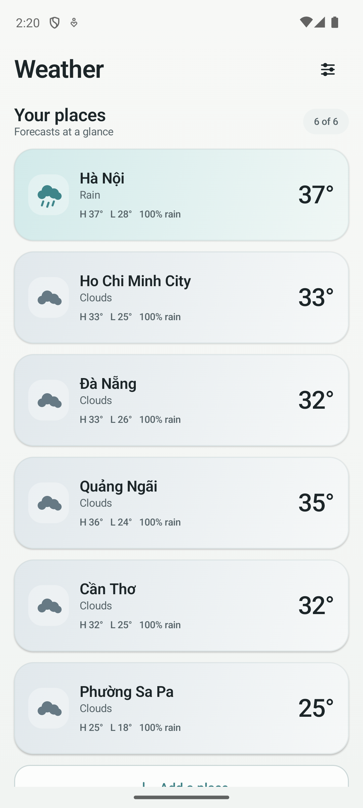</td>
    <td>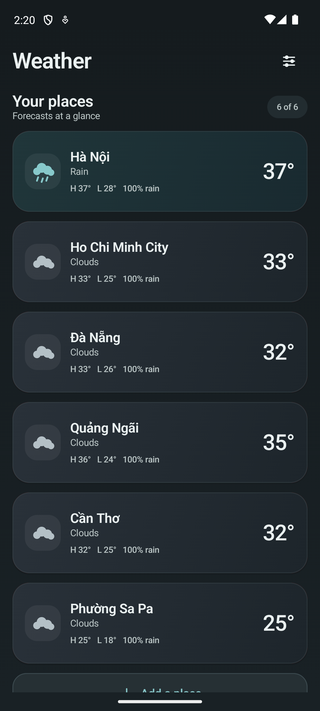</td>
    <td>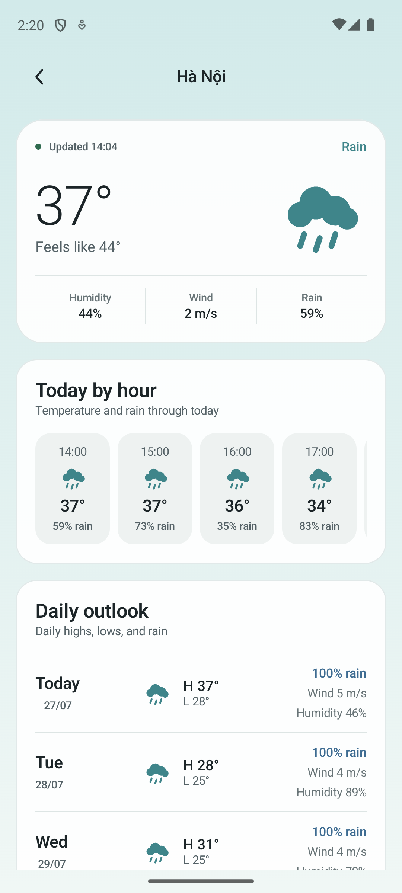</td>
  </tr>
  <tr>
    <td><strong>iOS</strong></td>
    <td>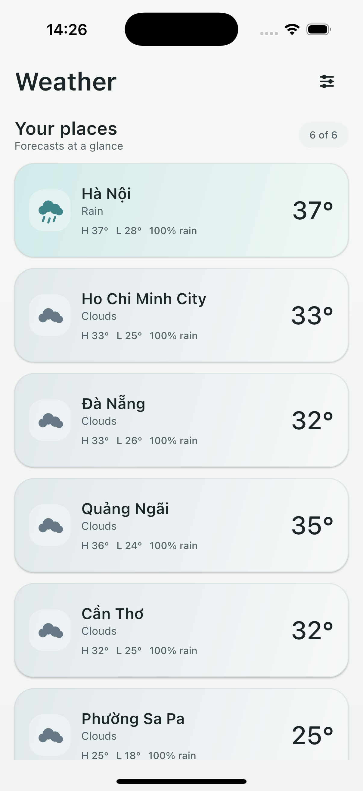</td>
    <td>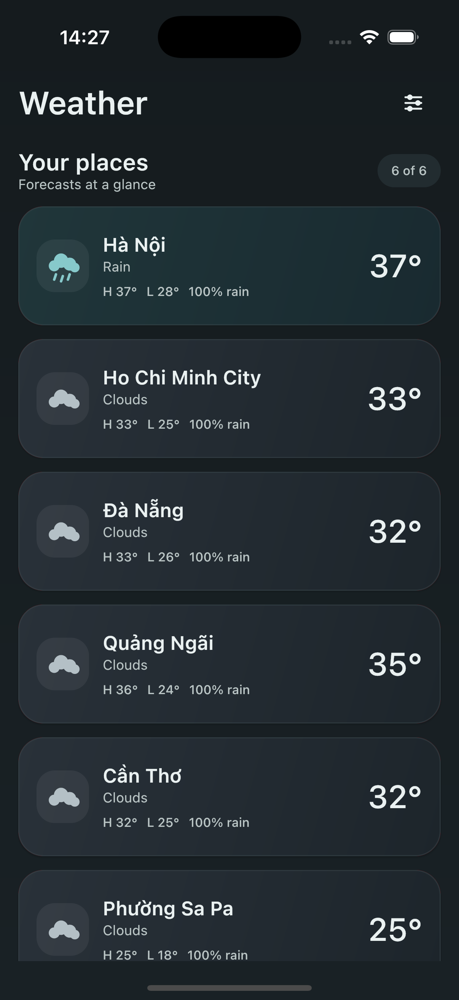</td>
    <td>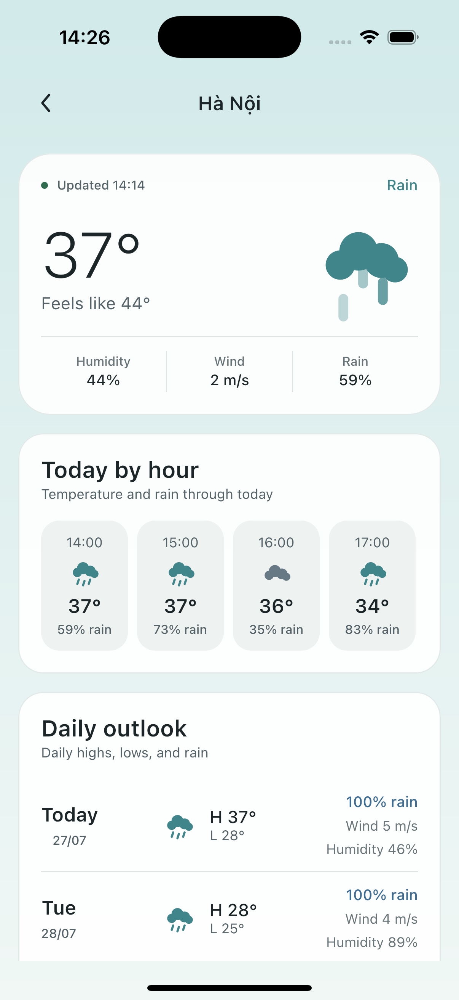</td>
  </tr>
</table>

Settings is where you pick the theme, so it is worth seeing in both. The three preview cards show
you what System, Light, and Dark actually look like before you commit to one, and units sit
underneath in a segmented control.

<table>
  <tr>
    <th></th>
    <th>Settings - Light</th>
    <th>Settings - Dark</th>
  </tr>
  <tr>
    <td><strong>Android</strong></td>
    <td>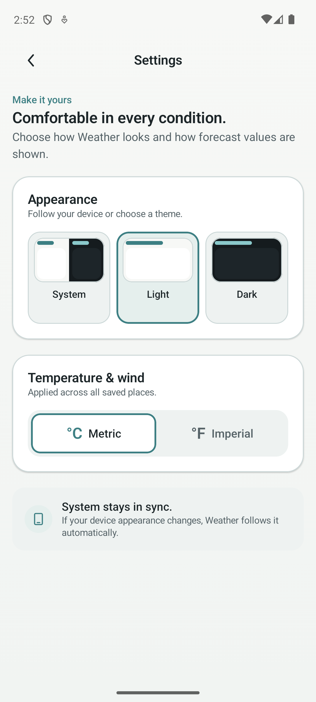</td>
    <td>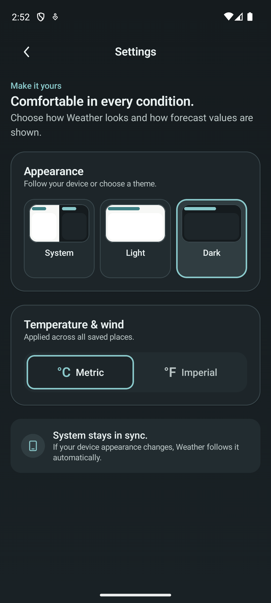</td>
  </tr>
  <tr>
    <td><strong>iOS</strong></td>
    <td>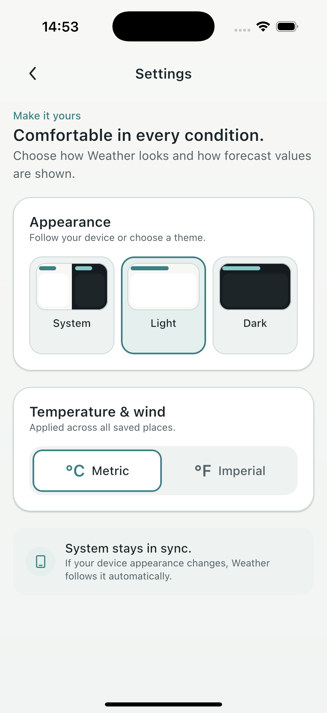</td>
    <td>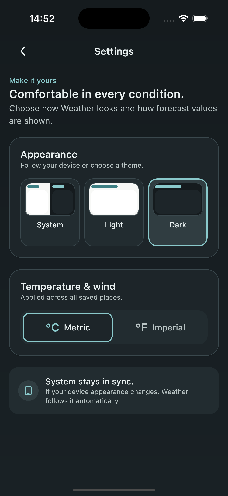</td>
  </tr>
</table>

## Features

- **Overview**: all your saved places at a glance, with the current temperature, the day's high
  and low, and the chance of rain. Pull down to refresh. Swipe to delete, with an undo if you
  change your mind.
- **Search**: type a city name and results come in as you go, backed by OpenWeatherMap's geocoding
  API. You can keep up to six places saved.
- **Detail**: current conditions at the top, an hourly rain strip covering the rest of today, and a
  7-day forecast below. The whole screen sits on a soft two-stop gradient keyed to that area's
  weather and time of day.
- **Motion, kept deliberately quiet**: icons in lists never animate. Only the Detail hero moves,
  and it gets one small gesture matched to the condition: a gentle turn, a slow breathe, a drift,
  falling rain or snow, or a single restrained thunder pulse. Every cycle is followed by a pause.
  The animation stops when the app goes to the background or the hero scrolls out of view, and if
  you have reduced motion turned on it does not run at all.
- **Adaptive layouts**: one shared set of width tiers drives all four screens, so no screen invents
  its own breakpoint. Phones and mid-size widths stay single column. At tablet widths, Detail puts
  the hero and the forecast panels side by side, and Overview switches to a two-column grid.
- **Theming**: pick Light, Dark, or System from theme preview cards in Settings, next to a
  segmented control for units. Your choice sticks. If you pick System, the app goes back to
  following the OS the next time the system theme actually changes. Theme decides brightness and
  weather only tints, so a rainy night will never drag a Light screen into darkness.
- **Works offline**: SQLDelight is the single source of truth. A 30-minute cache plus request
  coalescing keeps things quick and avoids repeat network calls. If a refresh fails you still see
  the cached forecast, clearly marked as out of date.
- **Units**: switch between metric (°C, m/s) and imperial (°F, mph). Switching clears the cache and
  refetches in the new units, and the choice survives a restart.
- **Accessibility**: every string lives in resources. Cards, forecast rows, and search results each
  read out as a single description rather than a pile of fragments. Section titles are marked as
  headings, status changes announce politely, and deleting a saved place has its own screen-reader
  action so swiping is never the only way. Every tappable target is at least 48 dp, checked at 200%
  font size on a 320 dp screen, and the Settings selectors work with an external keyboard.

## Tech stack

| Layer | Choice |
| --- | --- |
| UI | Compose Multiplatform, Material 3 |
| DI | Koin |
| Networking | Ktor (OkHttp on Android, Darwin on iOS) |
| Persistence | SQLDelight (Android SQLite driver / iOS native driver) |
| Preferences | multiplatform-settings (SharedPreferences on Android, NSUserDefaults on iOS) |
| Serialization | kotlinx-serialization, kotlinx-datetime |
| Testing | kotlin-test, Turbine, Ktor MockEngine, Compose UI testing (instrumented) |

## Architecture

Clean Architecture, with dependencies pointing one way: `presentation` -> `domain` <- `data`.

The `domain` layer holds the models, repository interfaces, and use cases, and imports no
frameworks at all. It is the one part of the codebase that has no idea Android, iOS, Compose, or
SQLDelight exist. Everything in `commonMain` is shared source that compiles for both targets, and
`androidMain` and `iosMain` contain nothing but the platform bindings each shared interface needs.

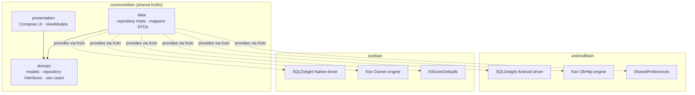

## Project layout

- `/composeApp` is the shared Kotlin Multiplatform module.
  - `commonMain` holds the domain, data, and presentation layers shared across both platforms.
  - `androidMain` and `iosMain` hold only the platform-specific bindings: SQL driver, HTTP engine,
    settings storage, and the Koin platform module.
  - `commonTest` and `androidUnitTest` hold unit tests for ViewModels, repositories, and mappers.
    `androidInstrumentedTest` holds the Compose UI tests that run on a device or emulator.
- `/iosApp` is the iOS app shell, a SwiftUI entry point hosting the shared Compose UI.

## Getting started

Want to clone this and build your own weather app on top of it? Here is the full path from zero to
a running build on both platforms.

1. **Install prerequisites**
   - JDK 17+
   - [Android Studio](https://developer.android.com/studio) (latest stable) with the Kotlin
     Multiplatform plugin
   - Xcode 15+ (macOS only, for the iOS target)
2. **Clone the repo**
   ```bash
   git clone https://github.com/nphkhiem/weather-forecast-by-kmp.git
   cd weather-forecast-by-kmp
   ```
3. **Get an OpenWeatherMap API key.** Sign up at
   [openweathermap.org](https://openweathermap.org/api) and subscribe to the **One Call by Call**
   plan. The free "Current Weather" tier is not enough, because One Call 3.0 is what powers both
   the forecast and the geocoding search. It includes 1,000 free calls a day before billing starts.
4. **Configure your key locally.** Add this line to `local.properties` at the repo root. That file
   is gitignored, so never commit a real key:
   ```properties
   owm.apiKey=YOUR_KEY_HERE
   ```
5. **Run on Android**: open the project in Android Studio and run the `composeApp` configuration,
   or from the command line:
   ```bash
   ./gradlew :composeApp:installDebug
   ```
6. **Run on iOS**: open `iosApp/iosApp.xcodeproj` in Xcode, pick a simulator, and hit Run. Or from
   the command line:
   ```bash
   xcodebuild -project iosApp/iosApp.xcodeproj -scheme iosApp -sdk iphonesimulator
   ```
7. **Run the tests**:
   ```bash
   # Unit tests (JVM + iOS simulator)
   ./gradlew :composeApp:testDebugUnitTest :composeApp:iosSimulatorArm64Test

   # Instrumented Compose UI tests (needs a running Android emulator/device)
   ./gradlew :composeApp:connectedDebugAndroidTest
   ```

## License

MIT, see [LICENSE](LICENSE). Fork it, extend it, ship your own version.

---

Learn more about [Kotlin Multiplatform](https://www.jetbrains.com/help/kotlin-multiplatform-dev/get-started.html).
